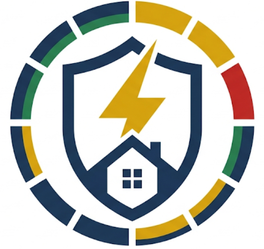

<div align="center">



# PURC Ghana Electricity Tariff

**Home Assistant integration that tracks live electricity tariffs published by Ghana's Public Utilities Regulatory Commission (PURC).**

[](https://github.com/hacs/integration)
[](https://github.com/nanakayjr/ha-purc-tariff/actions/workflows/validate.yml)
[](LICENSE)
[](custom_components/purc_tariff)

</div>

---

## Table of contents

- [About](#about)
- [Features](#features)
- [Sensors](#sensors)
- [Installation](#installation)
  - [HACS (recommended)](#hacs-recommended)
  - [Manual](#manual)
- [Configuration](#configuration)
- [Energy Dashboard](#energy-dashboard)
- [Diagnostics](#diagnostics)
- [Troubleshooting](#troubleshooting)
- [Development](#development)
- [Disclaimer](#disclaimer)
- [License](#license)

## About

PURC (Ghana's Public Utilities Regulatory Commission) publishes electricity tariffs through an online [Tariff Reckoner](https://www.purcghapp.com/Default.aspx) that residents can use to calculate their expected electricity charges. Tariffs change periodically, which makes it hard to keep track of the current rate you're being billed at.

This integration polls the PURC Tariff Reckoner on your behalf once a day and exposes the current rates as Home Assistant sensors, so you can:

- See your current tariff at a glance from the Home Assistant dashboard.
- Feed accurate, up-to-date cost data into the [Energy Dashboard](#energy-dashboard).
- Build automations/notifications around tariff changes (e.g. notify when the levy or service charge changes).

## Features

- 🔎 Automatic tariff discovery directly from the official PURC Tariff Reckoner.
- 🏠 Support for **Residential** and **Non-Residential** customer categories (including SLT LV/MV/MV2/HV/EV Charging tariffs).
- 💡 Lifeline tariff support for low-consumption residential customers.
- 🧾 Levy (tax) percentage calculation.
- 💵 Service charge extraction.
- 🔄 Configurable, automatic daily refresh with graceful fallback to the last known values if PURC's site is temporarily unavailable.
- ⚡ Works out of the box with the Home Assistant Energy Dashboard.
- 🩺 Built-in diagnostics support for easier troubleshooting.

## Sensors

The entities created depend on the customer category chosen during setup.

### Residential

| Sensor | Description | Unit |
| --- | --- | --- |
| Lifeline Tariff | Rate for lifeline (low, subsidized) consumption | GHS/kWh |
| Lifeline Service Charge | Fixed service charge at lifeline consumption | GHS |
| Regular Consumer Tariff | Rate for regular consumption (100 kWh reference) | GHS/kWh |
| High Consumer Tariff | Rate for higher consumption (400 kWh reference) | GHS/kWh |
| Levy Tax | Government levy applied on top of the energy charge | % |
| Regular/High Consumer Service Charge | Fixed service charge for regular/high consumption | GHS |

### Non-Residential (and SLT categories)

| Sensor | Description | Unit |
| --- | --- | --- |
| Regular Consumer Tariff | Rate for regular consumption (100 kWh reference) | GHS/kWh |
| High Consumer Tariff | Rate for higher consumption (400 kWh reference) | GHS/kWh |
| Levy Tax | Government levy applied on top of the energy charge | % |
| Regular/High Consumer Service Charge | Fixed service charge for regular/high consumption | GHS |

All sensors are grouped under a single **PURC Electricity Tariff** device and refresh automatically every 24 hours.

## Installation

### HACS (recommended)

[](https://my.home-assistant.io/redirect/hacs_repository/?owner=nanakayjr&repository=ha-purc-tariff&category=integration)

1. Make sure [HACS](https://hacs.xyz/) is installed.
2. In Home Assistant, go to **HACS → Integrations**.
3. Click the **⋮** menu (top right) → **Custom repositories**.
4. Add the repository URL `https://github.com/nanakayjr/ha-purc-tariff`, set the category to **Integration**, and click **Add**.
5. Search for **PURC Ghana Tariff** in HACS and click **Download**.
6. Restart Home Assistant.
7. Go to **Settings → Devices & services → Add Integration**, search for **PURC Ghana Tariff**, and follow the setup wizard.

### Manual

1. Download the latest release (or clone this repository).
2. Copy the `custom_components/purc_tariff` folder into your Home Assistant `config/custom_components/` directory, so you end up with `config/custom_components/purc_tariff/`.
3. Restart Home Assistant.
4. Go to **Settings → Devices & services → Add Integration**, search for **PURC Ghana Tariff**, and follow the setup wizard.

## Configuration

Configuration is done entirely through the Home Assistant UI (no YAML needed):

1. Go to **Settings → Devices & services → Add Integration**.
2. Search for **PURC Ghana Tariff**.
3. Select your customer category (`Residential`, `Non-Residential`, `SLT LV`, `SLT MV`, `SLT MV2`, `SLT HV`, or `SLT EV Chg`).
4. Submit — the integration immediately fetches the current tariffs and creates the relevant sensors.

You can add the integration multiple times with different customer categories if you need to track more than one tariff class.

## Energy Dashboard

To use the tariff sensors as a dynamic price entity in the [Energy Dashboard](https://www.home-assistant.io/docs/energy/):

1. Go to **Settings → Dashboards → Energy**.
2. Under **Electricity grid**, edit your grid consumption source.
3. Under "Use a static price" toggle it off, enable **Use an entity with current price**, and select the applicable tariff sensor (for example `sensor.regular_consumer_tariff`).

## Diagnostics

This integration supports Home Assistant's built-in diagnostics. To download diagnostic data for troubleshooting or bug reports:

1. Go to **Settings → Devices & services**.
2. Select the **PURC Ghana Tariff** integration.
3. Click the device, then the **⋮** menu → **Download diagnostics**.

Sensitive configuration values are automatically redacted.

## Troubleshooting

| Symptom | Likely cause | Fix |
| --- | --- | --- |
| Setup fails immediately | PURC website unreachable or changed layout | Check your internet connection and retry; open an issue if it persists |
| Sensors show `unavailable` | Temporary PURC outage | The integration keeps the last known values and retries automatically every 24 hours |
| Values seem outdated | Tariffs only refresh once a day | Reload the integration (**Settings → Devices & services → PURC Ghana Tariff → ⋮ → Reload**) to force an immediate refresh |

If you run into a persistent issue, please [open an issue](https://github.com/nanakayjr/ha-purc-tariff/issues) with the [diagnostics](#diagnostics) file attached and your Home Assistant logs (`Settings → System → Logs`, filtered to `purc_tariff`).

## Development

Clone the repository and install test dependencies:

```bash
pip install pytest requests beautifulsoup4
pytest test/
```

The test suite parses a captured HTML fixture ([test/fixtures/residential_100.html](test/fixtures/residential_100.html)) instead of making live requests, so it can run offline and in CI.

## Disclaimer

This is an unofficial, community-maintained integration. It is not affiliated with, endorsed by, or supported by PURC (Public Utilities Regulatory Commission) or the Government of Ghana. Tariff values are fetched directly from the [public PURC Tariff Reckoner](https://www.purcghapp.com/Default.aspx) and are provided as-is, without any guarantee of accuracy. Always refer to your official electricity bill for exact charges.

## License

Released under the [MIT License](LICENSE).

### HACS

1. Open HACS
2. Select Integrations
3. Add Custom Repository
4. Enter:
